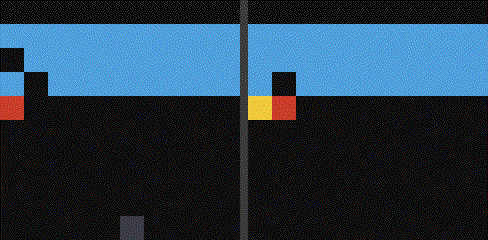

# napkin-dreams

Repo 4 of the **[napkin-gamemaster series](https://github.com/arose26/napkin-gamemaster)** (series home and index). Repos 1–3 were model-free. This one learns the game itself — a small world model trained on replayed experience — and trains the actor-critic **entirely inside its own dreams**. The real environment is touched only to collect data and to measure the truth.

> **How many real frames does a dream replace — and how long can you trust a dream before the policy starts exploiting its glitches?**



*Left: reality. Right: the model's dream, given the same start and the same 45 actions.*

## The experiment

Same env as [napkin-replay](https://github.com/arose26/napkin-replay) (MinAtar Breakout, sticky actions), so its model-free DQN curve overlays directly on the same real-env-steps axis. The arms are **dream horizons**:

| arm | dream length | why |
|---|---|---|
| `h3` | 3 steps | barely more than TD — is imagination even needed? |
| `h15` | 15 steps | Dreamer's usual neighborhood |
| `h45` | 45 steps | long enough to hallucinate |

World model, deliberately deterministic (no VAE, no KL machinery): conv encoder → 128-d latent, GRU dynamics over (latent, action), deconv reconstruction (grounds the latent), reward + done heads. Trained on **5-step open-loop windows** — encode once, roll the dynamics, match every step — which is what gives the horizon question teeth. Actor-critic: REINFORCE + value baseline on λ-returns with soft continues, latents detached at the policy boundary.

That detachment buys the repo's signature `selfcheck`: the imagination loop is a function of an arbitrary `step_fn`, so the check drives it with the **real simulator** instead of the model and asserts the machinery reproduces the env's rewards and resets **bit for bit**. After that, the learned model is provably the only difference between dreaming and living.

150k real env steps per run, 5 seeds per arm, IQM + bootstrap CIs, ties reported as ties. Each run also measures **open-loop divergence**: per-step reconstruction BCE of a 45-step dream against held-out reality.

## Hypothesis (registered before the sweep ran)

1. **Dreams are more real-frame-efficient early**: `h15` sits above the DQN curve for the first ~50k real steps (each real frame is reused by ~every dream), and stays at or slightly above it at 150k.
2. **Horizon is an inverted U**: `h15` > `h3` (3 steps can't span a rally) and `h15` > `h45` (divergence eats the long dreams).
3. Divergence BCE grows monotonically in dream depth with a visible knee well before step 45 — and `h45`'s policy quality should track that knee, not the nominal horizon.
4. The gif will show the model hallucinating at long horizons (bricks healing, ball duplicating) — the glitches the policy learns to exploit.

## Results

*(sweep running — filled in whichever way it lands)*

## Run it

```bash
pip install --target .deps "numpy<2" minatar
PYTHONPATH=.deps python3.10 napkin_dreams.py selfcheck   # ~4 min
PYTHONPATH=.deps python3.10 napkin_dreams.py sweep       # 3 arms x 5 seeds, overnight-able
PYTHONPATH=.deps python3.10 napkin_dreams.py plot
PYTHONPATH=.deps python3.10 napkin_dreams.py gif         # dream-vs-reality, side by side
```

`selfcheck` asserts: **imagination is exactly transparent to a real simulator** (60 steps, rewards and resets identical); λ-returns reduce to MC+bootstrap at λ=1 and one-step TD at λ=0 against hand recursions; a sure predicted done passes exactly `r` (no credit leaks across episode ends); replay windows never straddle a reset; the world model overfits one batch; the latent stays distinguishable while doing it (pairwise distance, not per-dim std — see INSIGHTS); dream training raises dream return end-to-end.

## What's deliberately not here

No stochastic latents, no KL balancing, no discrete codes, no straight-through gradients — Dreamer's machinery answers "how do I dream well at scale"; this repo asks the napkin question one level down. No dynamics-gradient actor (latents are detached; REINFORCE only), because that's what makes the transparency assert possible at all. Entropy bonus 1e-3 everywhere: unlike napkin-returns, dream training does thousands of updates on a narrow state distribution and collapses without it; it is a fixed background ingredient, not an arm.

## Model

Encoder conv 3×3 (16ch) → 128-d tanh latent; GRUCell dynamics; deconv decoder; 64-unit reward/done heads. Adam 3e-4 (model) / 1e-4 (AC), γ=0.99, λ=0.95, model batch 64×5-step windows, dream batch 256, one model batch + one AC batch every 8 env steps after 5k warmup. ~25 min per 150k-step run (h15) on an RTX 4050.
